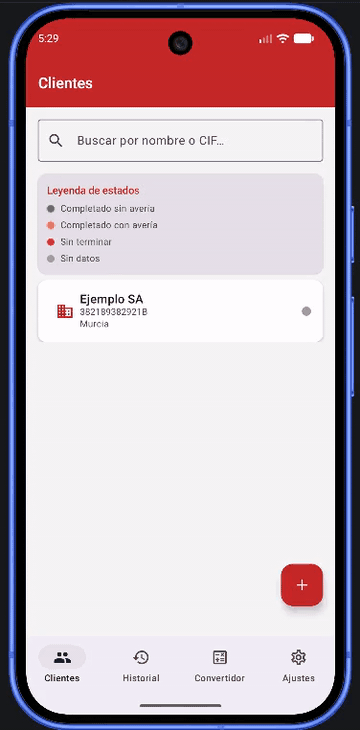
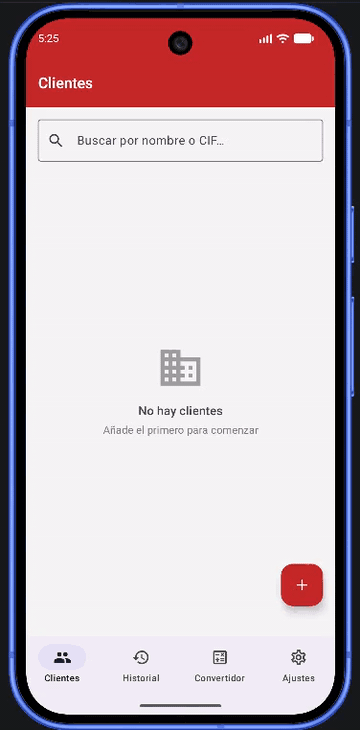
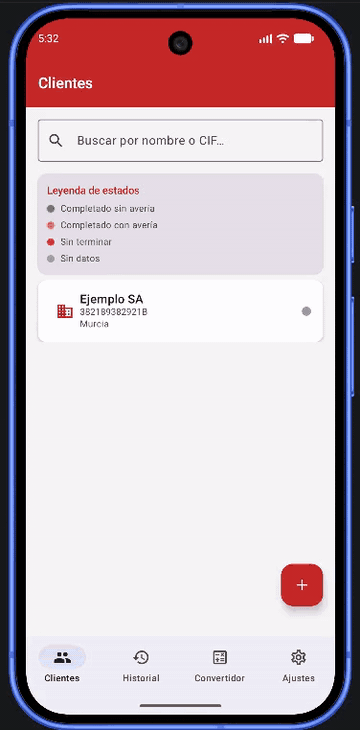
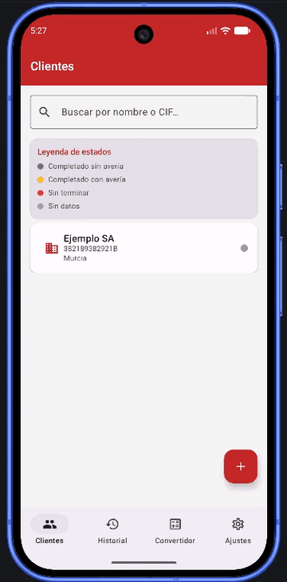
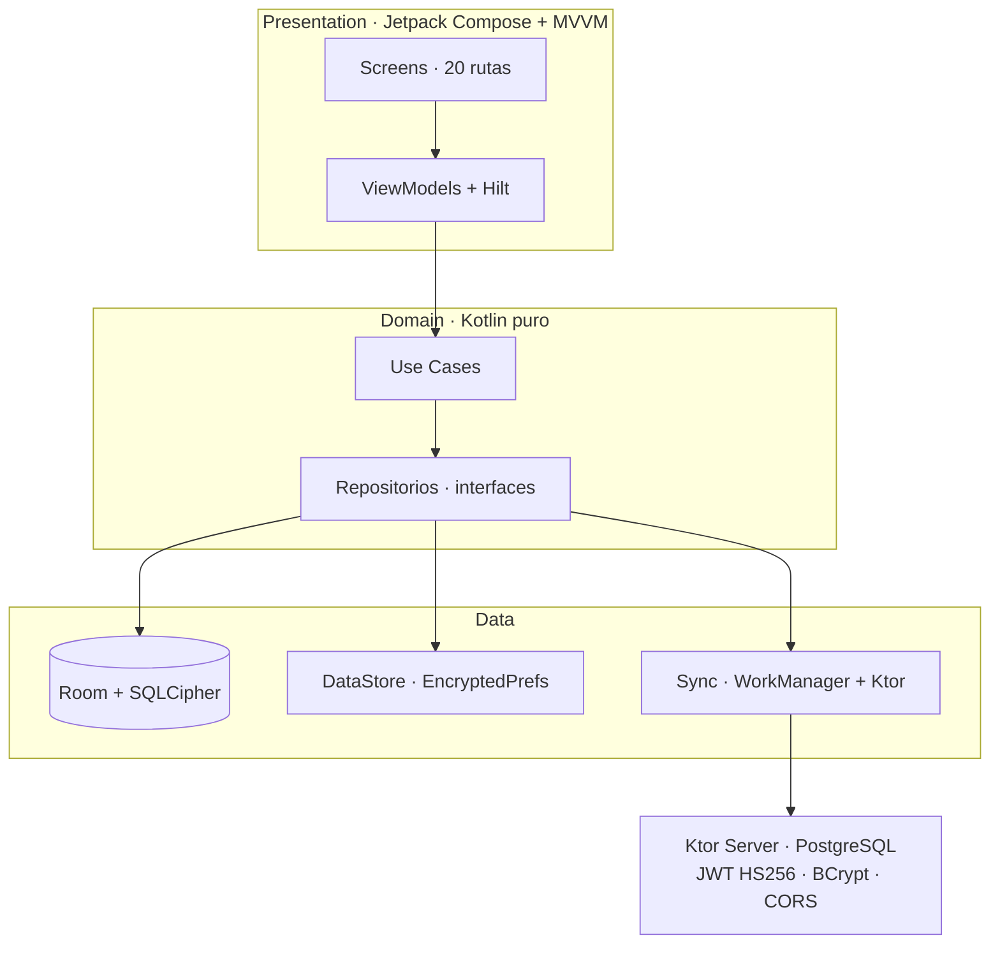

<div align="center">

# 🔥 FireFlow

**Gestión de Grupos de Presión contra Incendios**

[](https://github.com/DeepZixSoul/fireflow/actions/workflows/ci.yml)




*Curvas presión/caudal con **Vico** · chips de motor · lecturas al 0/50/100/140/200 %*

*App Android profesional para la gestión integral de grupos de presión contra incendios.
Clean Architecture, sincronización offline-first y documentación en PDF/CSV.*

</div>

---

## 📑 Índice

| | | | |
|:--|:--|:--|:--|
| [🏆 Highlights](#-highlights) | [👾 Acerca](#-acerca-del-proyecto) | [🎬 Demo](#-demo) | [⚡ Características](#-características) |
| [🏗️ Arquitectura](#️-arquitectura) | [🛠️ Tech Stack](#️-tech-stack) | [📊 Calidad](#-calidad) | [🔒 Seguridad](#-seguridad) |
| [🗺️ Roadmap](#️-roadmap) | [🚀 Setup](#-setup) | [📁 Estructura](#-estructura) | [📝 Licencia](#-licencia) |

---

## 🏆 Highlights

- 🧪 **393 tests automatizados** — 285 Android (269 unit + 16 instrumentados) y 108 del servidor Ktor
- 🏛️ **Clean Architecture + MVVM + Hilt** — 18 módulos Gradle con dependencias unidireccionales
- 🔒 **Seguridad en profundidad** — SQLCipher en disco, Argon2id (Android) y BCrypt (servidor), JWT HS256 y prefs cifradas
- 📡 **Offline-first** — Room + WorkManager con sincronización diferida contra Ktor/PostgreSQL
- 📈 **Curvas de rendimiento** — presión/caudal con Vico y tabla por motor (0/50/100/140/200 %)
- 📄 **Salidas profesionales** — informes PDF, exportación CSV y documentación con CameraX

---

## 👾 Acerca del Proyecto

FireFlow resuelve un problema real del sector de **protección contra incendios**: el control y
seguimiento de los grupos de presión (bombas de incendio) en instalaciones industriales y comerciales.

Está pensado para **técnicos y mantenedores en campo**: registra clientes, instalaciones, revisiones y
mediciones, trabaja **100 % sin conexión** y genera la documentación (PDF/CSV) que después se sincroniza
con un backend propio.

---

## 🎬 Demo

> 🎮 *Grabaciones reales de la app funcionando — sin retoques.
> Un bloque por acción: sigue el recorrido a tu ritmo.*

### 🔐 Acceso

**01 · Acceso seguro**

<div align="center">
  
  <p><sub>Usuario <b>admin</b> · <b>lockout</b> a los 5 intentos · cambio de contraseña forzado</sub></p>
</div>

### 📋 Altas de clientes y grupos

**02 · Crear cliente**

<div align="center">
  
  <p><sub>Validaciones de <b>CIF</b> y dirección → tarjeta creada con <b>leyenda de estados</b></sub></p>
</div>

### 🔧 Operativa diaria

**07 · Revisión**

<div align="center">
  
  <p><sub><b>Checklist</b> de mantenimiento → fotos, informe <b>PDF</b> y exportación <b>CSV</b></sub></p>
</div>

### 🕹️ Recorrido general

**09 · Flujo completo**

<div align="center">
  
  <p><sub>Navegación, <b>estados de color</b> y acciones en un único recorrido</sub></p>
</div>

<details>
<summary><b>▶ Ver las 5 capturas restantes</b> — altas avanzadas, curvas y utilidades</summary>

### 📋 Altas avanzadas

**03 · Crear grupo**

<div align="center">
  
  <p><sub><b>Selector de fechas</b> de instalación y mantenimiento → grupo registrado en el cliente</sub></p>
</div>

**04 · Añadir motores**

<div align="center">
  
  <p><sub>Motores <b>Diésel</b> y <b>Eléctricos</b> en paralelo con sus datos técnicos</sub></p>
</div>

**05 · Editar motores**

<div align="center">
  
  <p><sub>Edición de <b>potencia</b> y <b>caudal nominal</b> que alimentan las curvas</sub></p>
</div>

### 📈 Curvas de presión

**06 · Tabla de presiones y gráfica**

<div align="center">
  
  <p><sub>Tabla por motor → gráfica interactiva con selector de motor y lecturas por punto</sub></p>
</div>

### 🧮 Utilidades

**08 · Convertidor de unidades**

<div align="center">
  
  <p><sub>Conversión <b>en vivo y bidireccional</b>: L/min, m³/h, GPM, psi, bar, kPa, mCA</sub></p>
</div>

</details>

---

## ⚡ Características

- 🔐 Login seguro con **lockout anti-brute-force**
- 🔑 Cambio de contraseña forzado en el primer acceso
- 👥 CRUD completo de clientes con geolocalización
- 🔧 Gestión de grupos de presión y motores (diésel / eléctricos)
- 📅 Revisiones con checklists y estados de color
- 📈 Gráficas de curvas presión/caudal (Vico 2.1)
- 📄 Generación de informes PDF
- 📊 Exportación de datos CSV
- 📷 Captura y galería de fotos con CameraX
- 🧮 Convertidor de unidades en vivo (caudal y presión)
- 🔍 Búsqueda global en el historial
- 🔄 Sincronización offline-first con servidor Ktor
- 🌙 Tema oscuro / claro adaptativo
- ♿ Accesibilidad y *content descriptions*

---

## 🏗️ Arquitectura



| Capa | Responsabilidad | Módulos |
|:-----|:----------------|:--------|
| **Presentation** | UI, navegación, estados | `app`, `common`, `feature_*` (11) |
| **Domain** | Entidades, casos de uso, contratos | `domain` |
| **Data** | Repositorios, sync, fuentes de datos | `data`, `database`, `security` |
| **Core** | Config, utils, constants | `core` |
| **Server** | API REST, auth, persistencia | `server/` (proyecto Gradle separado) |

---

## 🛠️ Tech Stack

| Categoría | Tecnologías |
|:----------|:------------|
| **UI** | Jetpack Compose (BOM 2025.03.00) · Material3 1.3.1 · Vico 2.1.0 · Coil 2.7.0 · CameraX 1.4.1 |
| **Datos** | Room 2.6.1 + SQLCipher 4.6.1 · DataStore · EncryptedSharedPreferences · WorkManager 2.10.0 |
| **DI + async** | Hilt 2.53.1 · Kotlin Coroutines + Flow |
| **Backend** | Ktor 3.0.3 · PostgreSQL (H2 en tests) · JWT HS256 + BCrypt · Flyway |
| **Testing** | JUnit4 · Turbine · MockK · Room in-memory · Robolectric · Ktor Test Host |
| **Build** | Kotlin 2.1.0 · AGP 8.13.2 · Gradle 8.13 · minSdk 26 / targetSdk 35 · ProGuard-R8 |

---

## 📊 Calidad

| Métrica | Valor |
|:--------|:------|
| Módulos Gradle | **18** (Android) + servidor Ktor independiente |
| Archivos Kotlin | **217** (Android + servidor) |
| Código fuente | **~19.500** líneas |
| Tests | **393** → 285 Android (269 unit + 16 instrumentados) · 108 servidor |
| Rutas de navegación | **20** |
| Integración | CI en GitHub Actions: tests Android + tests de servidor |

---

## 🗺️ Roadmap

| Estado | Hito |
|:------:|:-----|
| ✅ | **v1.0** — CRUD completo, sync offline-first, seguridad y 393 tests |
| ✅ | **CI** — tests Android + servidor en cada push / PR |
| 🔄 | APK de **release firmado** y distribución |
| ⬜ | **Recordatorios** de mantenimiento (WorkManager + notificaciones) |
| ⬜ | **Roles y multiusuario** (hoy: usuario `admin` de semilla) |

---

## 🚀 Setup

```bash
# 1. Clonar el repositorio
git clone git@github.com:DeepZixSoul/fireflow.git
cd fireflow

# 2. Passphrase de la DB cifrada (obligatoria)
echo 'DB_PASSPHRASE=TuClaveSeguraAqui!' >> local.properties

# 3. Build del APK debug
./gradlew assembleDebug

# 4. Tests Android
./gradlew test

# 5. Tests del servidor
(cd server && ./gradlew test)

# 6. Instalar en dispositivo o emulador
adb install -r app/build/outputs/apk/debug/app-debug.apk
```

> ⚠️ **Requisitos**: JDK 21 · Android SDK 35 · `local.properties` con `DB_PASSPHRASE`.
> En macOS/Windows no hace falta exportar `JAVA_HOME`: usa el JDK 21 de Android Studio
> (*Settings → Build, Execution, Deployment → Build Tools → Gradle → Gradle JDK*).

---

## 📁 Estructura

<details>
<summary><b>▶ Árbol de módulos</b></summary>

```text
FireFlow/
├── app/                    # Módulo principal, navegación, DI
├── core/                   # Config, utils, constants
├── common/                 # Componentes UI compartidos y tema
├── domain/                 # Entidades, repositorios (interfaces), casos de uso
├── data/                   # Implementación de repos, sync, fuentes de datos
├── database/               # Room + SQLCipher, DAOs, migraciones
├── security/               # Hashing, sesiones, cifrado de prefs
├── feature_login/          # Login + cambio de contraseña
├── feature_clientes/       # CRUD de clientes
├── feature_grupos/         # Grupos de presión + motores
├── feature_revisiones/     # Revisiones + checklists
├── feature_curvas/         # Gráficas de rendimiento
├── feature_informes/       # Generación PDF
├── feature_exportaciones/  # Exportación CSV
├── feature_fotografias/    # Cámara + galería
├── feature_historial/      # Búsqueda global
├── feature_conversiones/   # Convertidor de unidades
├── feature_configuracion/  # Ajustes + sync
├── server/                 # Ktor + PostgreSQL (proyecto Gradle separado)
└── docs/gifs/              # GIFs de este README
```

</details>

---

## 🔒 Seguridad

- 🔑 **BCrypt** (cost 12) en el servidor · **Argon2id** (tCost 3 · mCost 64 MB · parallelism 4) en Android
- 🔐 **SQLCipher**: base de datos cifrada en disco con passphrase aleatoria en el Android Keystore (migración automática desde `DB_PASSPHRASE` legacy)
- 🔑 **EncryptedSharedPreferences** para la configuración del servidor
- 🎫 **JWT HS256** con expiración de 15 minutos
- 🌐 **CORS** restringido + **rate limiting** en los endpoints de autenticación
- 📝 **Logging** sin PII, tokens ni contraseñas
- 📦 Repo limpio: `local.properties`, `.env` y auditorías internas quedan fuera del versionado
- 🛡️ Controles, limitaciones y recomendaciones de despliegue en [SECURITY.md](SECURITY.md)

| OWASP Top 10 | Medida aplicada |
|:-------------|:----------------|
| A01 · Control de acceso | RBAC por rol + *claims* en el JWT |
| A02 · Fallas criptográficas | BCrypt (servidor) + Argon2id (Android) · SSL/TLS (`sslConnector`) y `sslmode` en producción |
| A03 · Inyección | Queries parametrizadas (Exposed) |
| A05 · Fallas de configuración | Secrets en variables de entorno, nunca en código |
| A07 · Falta de control de acceso | *Lockout* de cuentas + rate limiting por IP |
| A09 · Falta de registros de seguridad | Logging estructurado sin PII |

---

## 📝 Licencia

Distribuido bajo la licencia **MIT** — ver [LICENSE](LICENSE) para más detalles.

---

<div align="center">

Hecho con 🔥 y Kotlin para la seguridad contra incendios.

**👾 Retro. ⚡ Rápido. 🛡️ Seguro.**

[](https://github.com/DeepZixSoul/fireflow)

</div>
